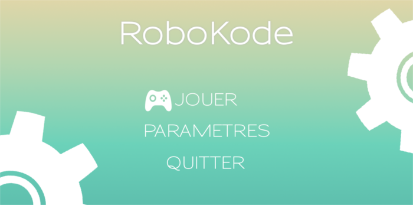
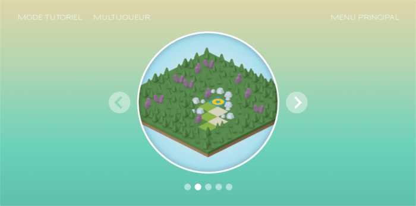
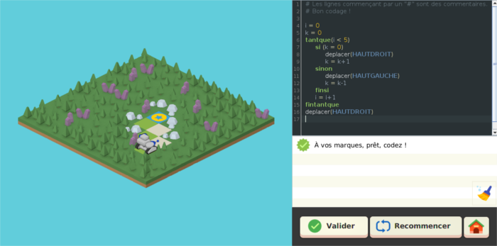

<h1 align="center">
    RoboKode: Un serious game pour apprendre la programmation
</h1>

## Screenshots

 

    
    
    

 

## Sommaire

* [Introduction](#introduction)
* [Installation](#installation)
* [Reproducing results](#reproducing-results)
* [Crédits](#crédits)

## Introduction

RoboKode est un serious game en 2D isométrique dédié à l'apprentissage de la programmation, et destiné à des apprenants collégiens. Ce jeu a remporté le prix du jury de professionnels lors d'un concours de serious games à l'[UGA](https://www.univ-grenoble-alpes.fr/) en 2018. Le jeu a été programmé en Java, et [libGDX](https://libgdx.com/), un framework de game development 2D entièrement open-source.

## Installation

Pour lancer un build du jeu, téléchargez IntelliJ. Vous aurez besoin de Java 1.8 avec une installation de JavaFX. Pour le reste des dépendances, le build Gradle devrait suffire !

## Crédits

Ce projet a été imaginé, designé et programmé par:

- Habib Slim
- Nathan Boulanger
- Léo Schmuck
- Vincent Dejonge
- Benjamin Bultel
